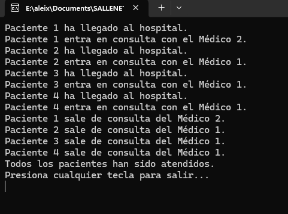

# Simulación de Consulta Médica - Tarea #1

## Descripción
Este proyecto simula la llegada de 4 pacientes a un hospital y su atención por parte de 4 médicos utilizando hilos en C#. Se asigna un médico aleatorio a cada paciente y la consulta dura 10 segundos.

## Tecnologías utilizadas
- Lenguaje: **C#**
- Entorno de desarrollo: **Visual Studio**
- Concurrencia: **Threads**

## Instrucciones de ejecución
1. Abrir **Visual Studio**.
2. Crear un nuevo proyecto de **Aplicación de Consola**.
3. Copiar el código en `Program.cs`.
4. Ejecutar con `Ctrl + F5`.

## Explicación del código
- Cada paciente llega cada **2 segundos**.
- Se crea un **hilo por paciente**.
- Se asigna un **médico aleatorio** (1-4).
- La consulta dura **10 segundos**.
- Se muestra un mensaje cuando el paciente entra y sale de consulta.

## Preguntas y Respuestas
### 1️ ¿Cuántos hilos se están ejecutando en este programa?
En total se estarían ejecutando un total de **5 hilos**, ya que tenemos el hilo principal y luego 4 otros hilos que serían los pacientes (4 pacientes). 

### 2️ ¿Cuál de los pacientes entra primero en consulta?
Siempre entraría primero el **paciente 1**, ya que es el primero en llegar. 

### 3️ ¿Cuál de los pacientes sale primero de consulta?
**Cualquiera de los 4**, porque la asignación de médicos es aleatoria y todos tardan lo mismo en consulta.

## Capturas de pantalla

