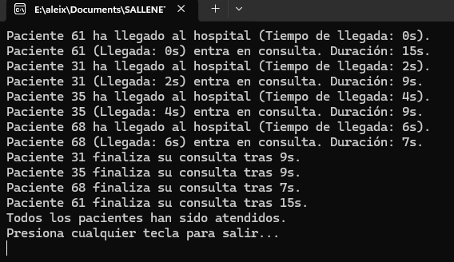

# Simulación de Consulta Médica - Tarea #2

## Descripción
Este proyecto amplía la simulación de atención médica agregando características adicionales a los pacientes, como un **ID único**, un **tiempo de consulta variable** y un **estado**.

## Tecnologías utilizadas
- Lenguaje: **C#**
- Entorno de desarrollo: **Visual Studio**
- Concurrencia: **Threads y SemaphoreSlim**

## Instrucciones de ejecución
1. Abrir **Visual Studio**.
2. Crear un nuevo proyecto de **Aplicación de Consola**.
3. Copiar el código en `Program.cs`.
4. Ejecutar con `Ctrl + F5`.

## Explicación del código
- Cada paciente tiene un **ID único (1-100)**.
- El tiempo de consulta es **aleatorio (5-15 segundos)**.
- Se mantiene una lista de pacientes con su **estado (Espera, Consulta, Finalizado)**.
- Se usa un **SemaphoreSlim** para restringir la consulta a 4 pacientes simultáneos.

## Preguntas y Respuestas
### 1️ ¿Cuál de los pacientes sale primero de consulta?
El paciente que sale primero siempre será el que **menos duración tenga de consulta**, ya que asignamos de forma aleatoria la duración de esta misma y cada una es diferente. 

## Capturas de pantalla

