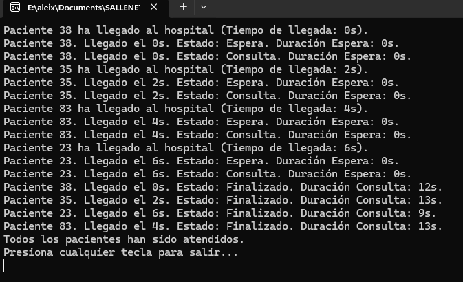

# Simulación de Consulta Médica - Tarea #3

## Descripción
Este proyecto añade la **visualización del avance** de cada paciente, mostrando sus cambios de estado y la duración de cada fase.

## Tecnologías utilizadas
- Lenguaje: **C#**
- Entorno de desarrollo: **Visual Studio**
- Concurrencia: **Threads y SemaphoreSlim**

## Instrucciones de ejecución
1. Abrir **Visual Studio**.
2. Crear un nuevo proyecto de **Aplicación de Consola**.
3. Copiar el código en `Program.cs`.
4. Ejecutar con `Ctrl + F5`.

## Explicación del código
- Se mantiene un **tiempo global** para calcular la duración de espera y consulta.
- Cada paciente cambia de estado de **Espera → Consulta → Finalizado**.
- Se muestra en consola el **ID del paciente, orden de llegada y duración de cada fase**.

## Preguntas y Respuestas
### 1️ ¿Has decidido visualizar información adicional a la planteada en el ejercicio? ¿Por qué? Plantea qué otra información podría ser útil visualizar. 
Si, ahora se muestra el tiempo de espera antes de entrar en consulta, lo que permite analizar cuánto tiempo estuvo un paciente en la sala de espera antes de ser atendido. 

## Capturas de pantalla
