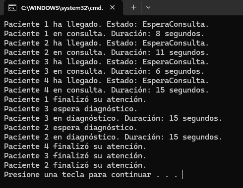

# Simulación de Unidades de Diagnóstico - Tarea #1

## Descripción
Este proyecto amplía la simulación de la atención médica agregando la posibilidad de que algunos pacientes requieran **pruebas de diagnóstico** tras la consulta médica. Se incluyen **máquinas limitadas (2)** para realizar las pruebas.

## Tecnologías utilizadas
- Lenguaje: **C#**
- Entorno de desarrollo: **Visual Studio**
- Concurrencia: **Threads y SemaphoreSlim**

## Instrucciones de ejecución
1. Abrir **Visual Studio**.
2. Crear un nuevo proyecto de **Aplicación de Consola**.
3. Copiar el código en `Program.cs`.
4. Ejecutar con `Ctrl + F5`.

## Explicación del código
- Se amplía la clase `Paciente` con el atributo `requiereDiagnostico` (booleano aleatorio).
- Se agregan **2 máquinas de diagnóstico**, usando un `SemaphoreSlim(2)` para gestionar el acceso.
- Los pacientes pasan por **consulta médica primero**, y si necesitan diagnóstico, esperan su turno.
- Se muestran los **estados de cada paciente** en la consola:
  - `EsperaConsulta`: Aún no entra a consulta.
  - `Consulta`: Está siendo atendido por un médico.
  - `EsperaDiagnostico`: Ha terminado la consulta, pero espera una máquina.
  - `Diagnostico`: Se encuentra en una máquina de diagnóstico.
  - `Finalizado`: Ha completado todo el proceso.

## Preguntas y Respuestas
### 1️ ¿Los pacientes que deben esperar para hacerse las pruebas de diagnóstico entran luego por orden de llegada?
Sí, entran a las máquinas de diagnóstico en orden de llegada si todas están ocupadas. Para comprobarlo:
- Se registran los tiempos de llegada de cada paciente.
- Se observa el orden en que entran a diagnóstico en la consola.
- Si un paciente debe esperar, entra cuando haya una máquina libre.

## Capturas de pantalla
