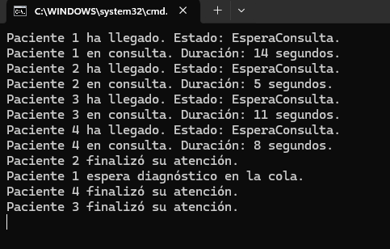

# Sincronización de Diagnóstico - Tarea #2

## Descripción
Este proyecto amplía la simulación hospitalaria asegurando que **los pacientes pasen a diagnóstico en el orden en que llegaron al hospital**, sin importar el tiempo que hayan estado en consulta. Para ello, se implementa una **cola de prioridad**.

## Tecnologías utilizadas
- **C#**
- **Visual Studio**
- **Threads, SemaphoreSlim y AutoResetEvent**

## Instrucciones de ejecución
1. Abrir **Visual Studio**.
2. Crear un nuevo proyecto de **Aplicación de Consola**.
3. Copiar el código en `Program.cs`.
4. Ejecutar con `Ctrl + F5`.

## Explicación del código
- Se usa una **cola (`Queue<Paciente>`)** para gestionar el orden de llegada de los pacientes que necesitan diagnóstico.
- **Cuando un paciente termina la consulta**, si necesita diagnóstico, entra en la cola de espera.
- **Solo el paciente en la cabeza de la cola puede acceder a la máquina de diagnóstico**, garantizando el orden correcto.
- Se usa un **`AutoResetEvent`** para sincronizar el acceso a la máquina de diagnóstico.
- Una vez que un paciente finaliza su diagnóstico, se **libera al siguiente en la cola**.

## Preguntas y Respuestas
### 1️ Explica la solución planteada en tu código y por qué la has escogido.
Se ha implementado una **cola de prioridad basada en el orden de llegada al hospital**. Esta solución es eficiente porque:
- **Mantiene el orden de llegada**, evitando que pacientes que terminan antes la consulta se adelanten.
- **Sincroniza el acceso** con `AutoResetEvent`, evitando bloqueos o esperas innecesarias.
- **Usa `Queue<Paciente>`**, que es óptima para manejar estructuras FIFO (First-In-First-Out).

### 2️ Plantea otra posibilidad de solución a la que has programado.
Otra opción sería usar un **diccionario ordenado (`SortedDictionary<int, Paciente>`)**, donde la clave sea el número de llegada del paciente. De esta forma:
- Los pacientes quedarían ordenados automáticamente.
- Se podría usar un `Monitor` para asegurar que solo el paciente con el menor número de llegada pase al diagnóstico.
- Este método permitiría más flexibilidad en la gestión de pacientes con diferentes tiempos de espera y prioridad.

## Capturas de pantalla

