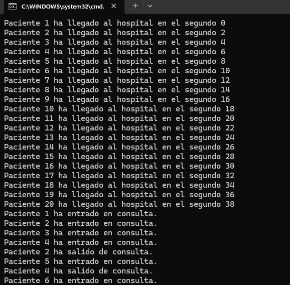
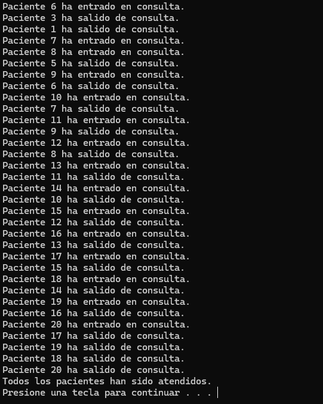

# Simulación de Más Pacientes - Tarea #3

## Descripción
Este proyecto simula la llegada de 20 pacientes a un hospital con 4 médicos disponibles. Los pacientes llegan de manera secuencial, uno cada 2 segundos. Si no hay consulta médica disponible, los pacientes deben esperar en la sala de espera hasta que se libere una consulta.

## Tecnologías utilizadas
- **Lenguaje**: C#
- **Entorno de desarrollo**: Visual Studio
- **Concurrencia**: Threads

## Instrucciones de ejecución
1. Abrir Visual Studio.
2. Crear un nuevo proyecto de Aplicación de Consola.
3. Copiar el código en `Program.cs`.
4. Ejecutar con `Ctrl + F5`.

## Explicación del código
1. Los pacientes llegan al hospital cada 2 segundos.
2. Se genera un hilo para cada paciente.
3. Los pacientes son atendidos por los 4 médicos disponibles. Si no hay médicos disponibles, los pacientes esperan.
4. El tiempo de consulta de cada paciente se simula con un tiempo aleatorio entre 5 y 15 segundos.
5. En consola, se muestra un mensaje cada vez que un paciente llega y sale de consulta.

## Preguntas y Respuestas

### 1️ ¿Los pacientes que deben esperar entran luego a la consulta por orden de llegada?
· Planteamiento actual: Se han creado hilos para simular la llegada de 20 pacientes, con un intervalo de 2 segundos entre cada uno. Utilizo un SemaphoreSlim para gestionar las consultas médicas, permitiendo un máximo de 4 pacientes siendo atendidos simultáneamente.

· Otra solución posible: Se podría usar un BlockingCollection en lugar de un semáforo, que administraría tanto el número de pacientes como su orden de llegada. Esta colección proporciona una sincronización más natural para situaciones como estas, gestionando automáticamente los elementos en espera.

### 2 ¿Los pacientes que deben esperar entran luego a la consulta por orden de llegada?
Sí. La cola de espera asegura que los pacientes que están en estado de "EsperaConsulta" se atienden por orden de llegada. He probado este comportamiento asegurando que cada paciente espere hasta que haya un médico disponible antes de entrar en consulta.

## Capturas de pantalla

