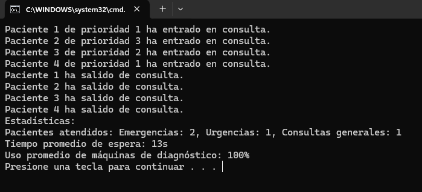

# Estadísticas y Logs - Tarea #5

## Descripción
Este proyecto calcula y muestra estadísticas sobre la atención de los pacientes. Se incluyen las estadísticas de los pacientes atendidos por prioridad, el tiempo promedio de espera y el uso promedio de las máquinas de diagnóstico.

## Tecnologías utilizadas
- **Lenguaje**: C#
- **Entorno de desarrollo**: Visual Studio
- **Concurrencia**: Threads

## Instrucciones de ejecución
1. Abrir Visual Studio.
2. Crear un nuevo proyecto de Aplicación de Consola.
3. Copiar el código en `Program.cs`.
4. Ejecutar con `Ctrl + F5`.

## Explicación del código
1. Se cuentan los pacientes atendidos por cada nivel de prioridad.
2. Se calcula el tiempo promedio de espera de los pacientes antes de ser atendidos.
3. Se calcula el porcentaje de uso de las máquinas de diagnóstico durante la simulación.
4. Al final de la simulación, se muestran las estadísticas en consola.

## Preguntas y Respuestas

### 1️ ¿Puedes explicar tu código y por qué has decidido hacerlo así?
He decidido calcular las estadísticas mientras los pacientes son atendidos. Utilizo variables acumulativas para contar los pacientes atendidos por prioridad y el tiempo total de espera para calcular el promedio. Esto me permite obtener las estadísticas de manera eficiente al final de la simulación.

## Capturas de pantalla

