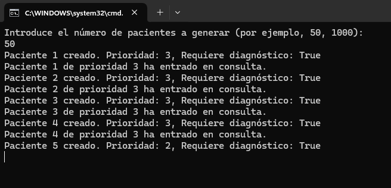
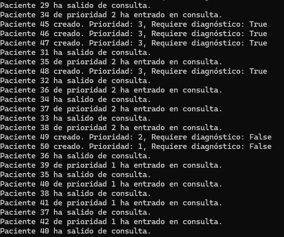
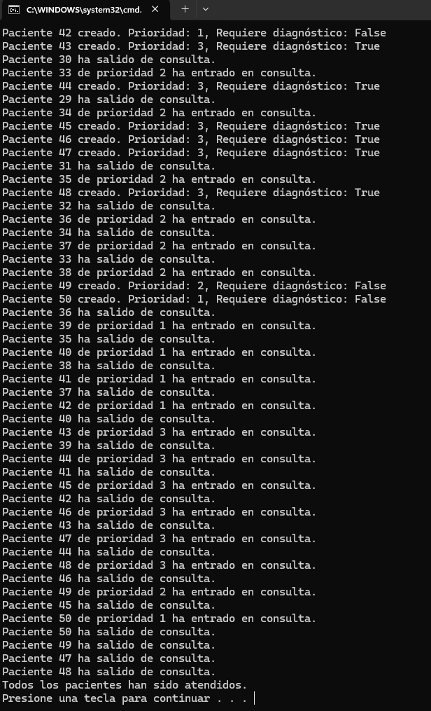

# Simulación de Generador de Pacientes - Tarea #1

## Descripción
Este proyecto simula la llegada y atención de pacientes en un hospital utilizando hilos en C#. En este ejercicio, hemos modificado la generación de pacientes para que sea dinámica y variable. Un generador de pacientes se ejecuta cada 2 segundos, creando un nuevo paciente con atributos aleatorios como el tiempo de consulta, la prioridad (Emergencia, Urgencia, Consulta general) y si requiere diagnóstico adicional con máquina. Los pacientes son atendidos por médicos simultáneamente con un máximo de 4 consultas disponibles.

## Tecnologías utilizadas
- Lenguaje: C#
- Entorno de desarrollo: Visual Studio
- Concurrencia: Hilos (Threads)
- Sincronización: Semáforo (`SemaphoreSlim`)

## Instrucciones de ejecución
1. Abre Visual Studio.
2. Crea un nuevo proyecto de Aplicación de Consola en C#.
3. Copia el código del archivo `Program.cs` en tu proyecto.
4. Ejecuta el programa con `Ctrl + F5`.
5. Se te pedirá ingresar el número de pacientes a generar (puedes introducir un número como 50, 100, 1000, etc.).
6. El sistema generará pacientes con atributos aleatorios, los atenderá y mostrará el avance en la consola.

## Explicación del código
1. **Generación de pacientes**:
   - El programa solicita al usuario el número de pacientes a generar.
   - Cada 2 segundos, el generador crea un paciente con atributos aleatorios:
     - Tiempo de consulta (entre 5 y 15 segundos).
     - Prioridad (1 para Emergencia, 2 para Urgencia, 3 para Consulta general).
     - Si requiere diagnóstico adicional (valor booleano aleatorio).

2. **Creación de hilos**:
   - Para cada paciente, se crea un hilo que simula la consulta médica.
   - Se asegura que solo 4 pacientes sean atendidos simultáneamente utilizando un semáforo (`SemaphoreSlim`).

3. **Simulación de consulta**:
   - Cada paciente entra en consulta cuando hay una consulta disponible.
   - El semáforo limita el número de consultas activas a 4.
   - Después de ser atendido, el paciente sale de consulta y el semáforo se libera.

4. **Generador de pacientes**:
   - Los pacientes se generan cada 2 segundos, y se asignan a hilos para ser atendidos.

5. **Finalización**:
   - Al finalizar la simulación, se espera a que todos los hilos terminen antes de mostrar el mensaje final de que todos los pacientes han sido atendidos.

## Preguntas y Respuestas

### Tarea 1: ¿Cumple requisitos?

- Se prueba generando un número de pacientes determinado, como 50, 100 y 1000, para asegurar que el generador funciona correctamente. Cada paciente tiene atributos aleatorios, y se simula su atención.

- El código cumple los requisitos del generador dinámico de pacientes. Cada 2 segundos se genera un nuevo paciente con atributos aleatorios. El semáforo asegura que el número máximo de pacientes simultáneamente atendidos sea 4.

### Tarea 2: ¿Qué comportamientos no previstos detectas?

- Al generar un número elevado de pacientes, como 1000, la consola puede llenarse rápidamente con mensajes de pacientes atendidos, lo que podría dificultar la lectura de los resultados. Además, al haber más pacientes, algunos pacientes podrían esperar mucho tiempo debido a la limitación de consultas disponibles.

- Cuando el número de pacientes aumenta significativamente, el programa puede volverse más lento debido a la sobrecarga de crear y atender tantos pacientes. La consola podría llenarse rápidamente con mensajes, lo que dificulta observar el flujo y la atención de los pacientes. Además, los pacientes que requieren diagnóstico adicional deben esperar más, lo que puede generar un retraso general.

### Tarea 3: ¿Cómo adaptarías tu solución?
- Para mejorar la eficiencia y legibilidad, se podría agregar un sistema de paginación o mostrar solo los mensajes más relevantes, como el número total de pacientes atendidos o la cantidad de pacientes en espera. 
- Otra mejora sería optimizar la generación de pacientes, de forma que, en lugar de crear pacientes cada 2 segundos, se pueda hacer de forma controlada para evitar sobrecargar el sistema cuando se manejan grandes volúmenes de pacientes.
- Se podría implementar un sistema de logs que permita ver el comportamiento de la simulación sin sobrecargar la consola.

## Capturas de pantalla

